## Finished Technical Assesment

Start date: April 17th, 2024 
Deadline: May 1st, 2024 

### Evaluation challenge details:

If you are applying for a gameplay/UI role, please stay here and continue once you've completed the test below. If you are applying for another role, please continue until your corresponding section.

The goal is to create a Space Invaders type of game, using the base game design from space invaders. The spin we will add to this is that you must include a mechanic where the player can slow time down, stop time or reverse time after acquiring sufficient crystals (crystal details below).

The crystals you gather in this game are dropped at a 40% drop rate from the alien enemies, and at a 100% drop rate from elite enemies. We want 2 types of enemies and for the conduct to be a simple loop, similar to Space Invaders, where the players actions do not influence the enemy conduct in any dynamic way.

1 Crystal - Slow Time for 3 seconds 
2 Crystals - Stop Time for 3 seconds 
3 Crystals - Reverse Time 3 Seconds 

This should be done in Unreal Engine 5, and not 4. 
Gameplay mechanics and core logic should be written in C++. 
There should be three visually different enemy types, but all behave the same. 
An enemy can shoot if no other enemy is in front of it. 
Additionally a UFO will sometimes go across the top of the screen which the player can shoot for bonus points. 
Enemies move left or right as a group and shift downward and change direction every time they reach the screen's edge. 
Enemy group speed gradually increases as enemies are destroyed. 
The player has three lives. 
The game saves the highest score between sessions. 
In each advancing level the enemies start one row lower, unless already at the lowest possible one. 
Above the player are "bunkers" which get eroded when shot at by either the player or enemies, or if they get touched by enemies. 
Cite your sources in your code comments if you use code/methods from elsewhere. 
You're allowed to use Quixel Megascans or marketplace assets as long as they're assets only (no code or BP). 
Feel free to change the visual theme of the game (it doesn't have to be in space). 

You will be judged on:

How clean and organized your code is. 
How creatively you solve some of the presented problems. 
How decent your communication is. 

You will not be judged on:

How good it looks visually. 
How fast you deliver it. 
How much you resolve on your own. 

Good luck.

---
### 20/04/24 Saturday night update:

The game is taking shape. I just finished the skeleton of the game, that is, the most important classes. I have a lot of things left to do, but from here everything will be built on a good foundation :) 

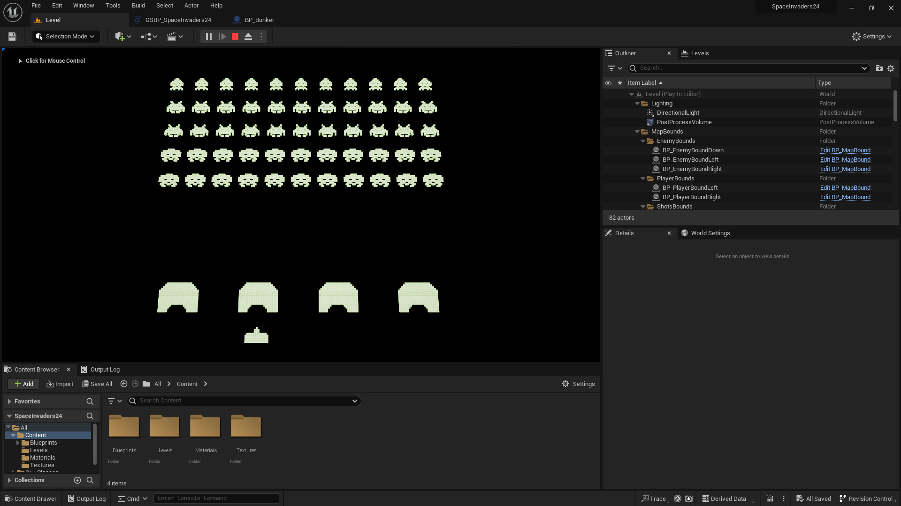
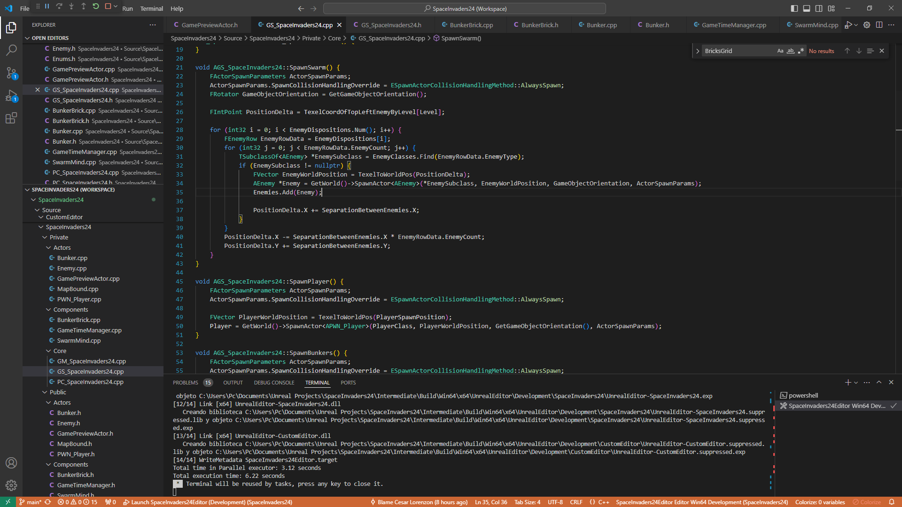

---
### 23/04/24 Tuesday night update:

Well, continuing with the challenge, I already have a big part of the game done. I still need a few things, but I've reached that stage where every time you hit play to test something, you end up getting hooked playing because it's really fun 😂

Poor aliens, I still haven't given them the power to defend themselves. 

---
### 24/04/24 Alpha Time!

Well, it's time, and I managed to complete a large part of the challenge. I prioritized maintaining clean and scalable code over finishing with a project full of patches. Some of the tasks couldn't be completed, not due to lack of ability but due to lack of time. I estimate that with two more days, I could complete the remaining points, which include making the bunkers able to receive shots and erode, game flow and scenes, and of course, a UI to assist us.

My priorities were to make the enemies increase their speed as the quantity decreased and to make the player's abilities work, including the biggest challenge of making time able to rewind, and the truth is that the solution to that problem was simpler than I imagined.

Unfortunately, when it came time to finalize this challenge and build the game, I encountered what happens to anyone when they're in a hurry and want to print a document. A cryptic error that prevents the game from running, and [searching for a solution in the Unreal forums](https://www.google.com/search?q=No+precompiled+movie+scene+data+is+present+for+sequence+%27Sequence%27.+This+should+have+been+generated+and+saved+during+cook.+site:forums.unrealengine.com&sca_esv=40c8a0742f288946&sca_upv=1&sxsrf=ACQVn0_venAEdIhBeIwfR0I3jNxdvbC61w:1714013358571&sa=X&ved=2ahUKEwjnsoKrrdyFAxW0qpUCHUXlC2EQrQIoBHoECCMQBQ&biw=1920&bih=959&dpr=1#ip=1), I find many people who have encountered the same issue, all without an answer.

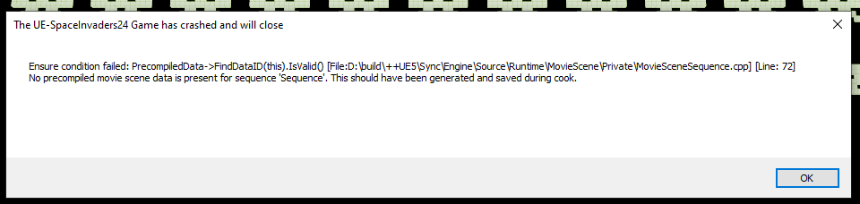

I changed the build configuration from Development to Shipping, and the result was another error.

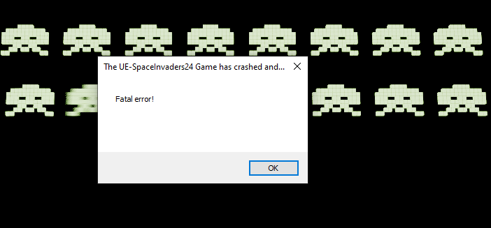

The most curious thing about this is that I didn't change anything in the project configuration when just today I managed to build successfully. Luckily, I saved it, and now I can share it with you. The bad news is that this version, which works, is outdated and doesn't contain two of the requested and most important requirements: one is that in this version, we don't have the abilities to manipulate time available, and the other is that in this version, enemies don't shoot at the player, so the only way to lose is for the enemies to reach the player.

Because of this, I record a video of the updated gameplay from the Unreal editor so that at least you can see clearly what the final version of the game contains.

[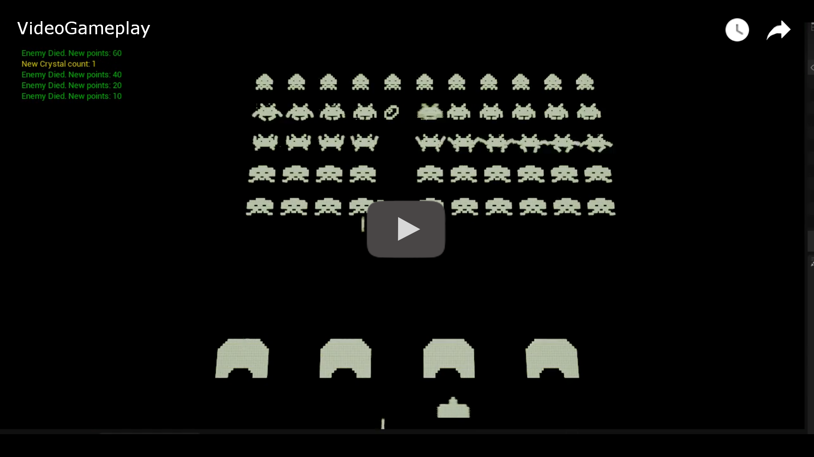](https://youtu.be/685fZSb53ho)

You can download the [latest playable version of the game here](https://github.com/cesarl94/SpaceInvaders24/releases/tag/0.1.0) (Version 0.1.0)

---

The game controls are as follows: 
* Move sideways: ←→ (arrow keys) 
* Shoot: Spacebar 
* Slow time: 1 (requires at least 1 crystal) 
* Stop time: 2 (requires at least 2 crystals) 
* Reverse time: 3 (requires 3 crystals) 
* To exit the game press Alt + F4

---

### 25/04/24 Thursday night update:

I found the error that was preventing the game from being playable. Almost undetectable, but I found it by debugging using the elimination method. The culprit? This simple and almost harmless ``const`` that had slipped my attention, and neither VSCode nor Unreal could tell me it was needed there. The most curious thing is that you can play from the editor without any issues, but not from the executable.

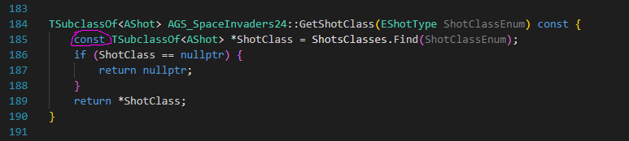

You can download [this version of the game here](https://github.com/cesarl94/SpaceInvaders24/releases/tag/0.1.1) (Version 0.1.1).

---

### 27/04/24 Saturday of coding!

Still tackling the Space Invaders challenge. Today I finished bringing the shots to life. Since the last video I uploaded until today, I added several things, among them, crystals that are dropped by enemies, and when shot at, they are collected. These crystals allow us to manipulate time. With 1, I make time run slower, with 2 I can stop time, and with 3 the enemies will rewind 3 seconds back in time. In addition to that, the enemies now have something to defend themselves with! They shoot back, and those shots can kill the player or erode the bunkers. They even collide with each other, just like in the original arcade game.

Now, I'm going to work on giving this game a UI to inform us of what's happening in the game.

There's new gameplay video!

[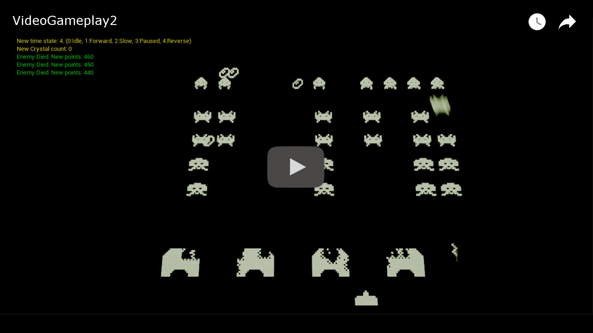](https://www.youtube.com/watch?v=U96QdHXcFZc)

You can download [this version of the game here](https://github.com/cesarl94/SpaceInvaders24/releases/tag/0.1.2) (Version 0.1.2)

---

### 28/04/24 Sunday night report

Today I finished the first part of the UI. I started with the most difficult part, which is the skills section, as everything is almost animated, and everything depends on each other. The result looks quite good, feels good, and I think it's very easy for the user to understand.

Next up is the rest of the UI, life indicators, points, etc. And signs for level, game over, etc. I've already made two String Tables to have the game in both Spanish and English; implementation is the only thing left.

Along with that, the scene flow will also need to be addressed.

Here you can see a new video about the progress of the game
[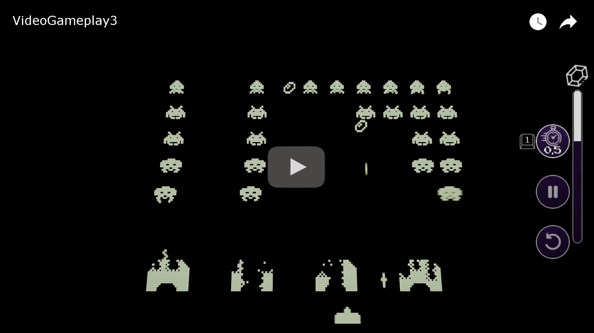](https://www.youtube.com/watch?v=xv49vm1mIrs)

You can download [this version of the game here](https://github.com/cesarl94/SpaceInvaders24/releases/tag/0.1.3) (Version 0.1.3)

---

### 29/04/24 Tuesday night update!

The entire UI and scene flow are now ready. Now, we don't need to close the program every time we want to start over, as we can revive upon death (if we have enough lives, of course), or we can move on to the next level.

We can also reach game over if we lose enough lives and start over from the beginning if we wish from the new menu.

Additionally, the UI will now display our points, lives, and the level we're on, as well as show messages about the game state.

The game is almost ready! Even though tomorrow is the deadline, I'm confident that the only thing I'm missing will be ready by morning, which is data persistence for the high score.

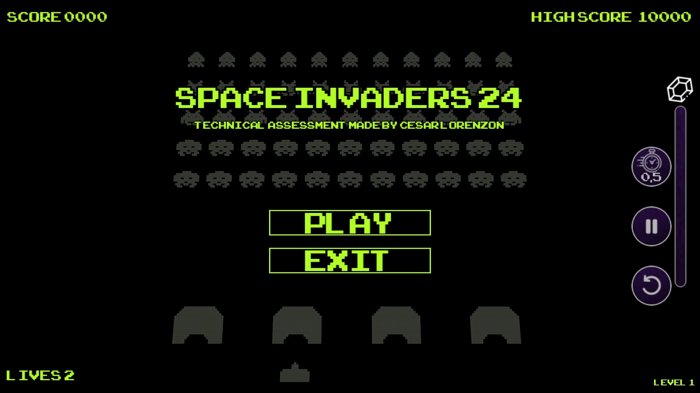
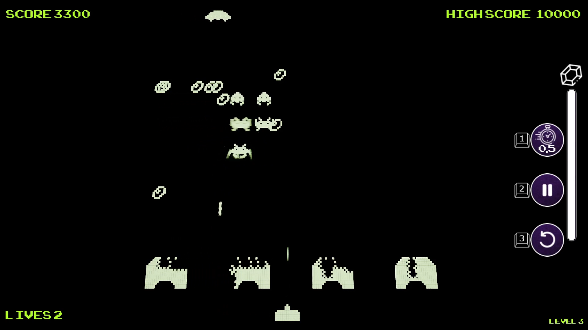
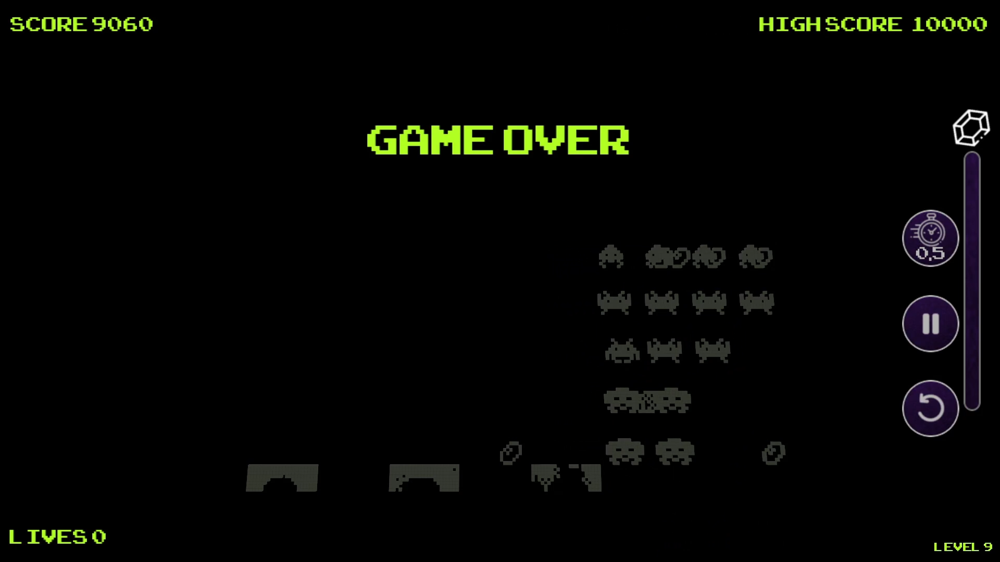

Now I'll leave you with a video of the new gameplay. It's amazing how much has changed from the last version with just a few hours of work.

[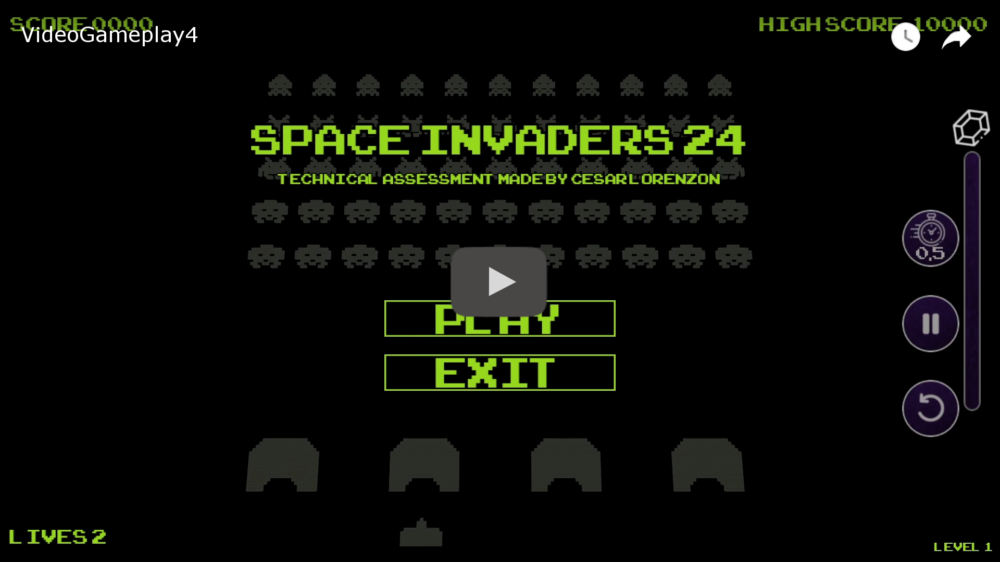](https://www.youtube.com/watch?v=ADIVV2KrXtY)

You can download [this version of the game here](https://github.com/cesarl94/SpaceInvaders24/releases/tag/0.1.5) (Version 0.1.5)

---

### 01/05/24 Happy Workers' Day!

Today is the deadline. I've just uploaded the final change as requested to be evaluated, which is to achieve the maximum score and have it saved between sessions. So, I can relax now (a bit).

Although I won't be judged on the visual aspect of the game in this project, I would like to spend the rest of the day making it look nicer.

You can download [this version of the game here](https://github.com/cesarl94/SpaceInvaders24/releases/tag/0.1.6) (Version 0.1.6)
