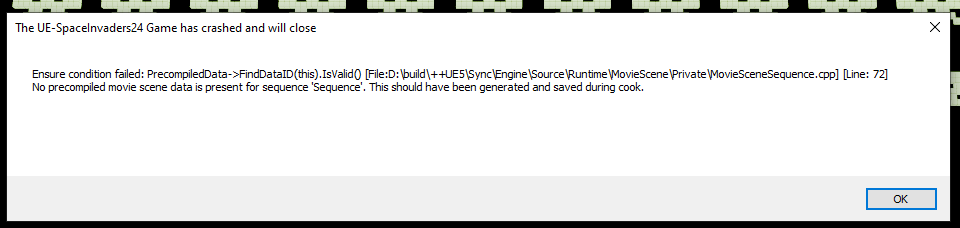
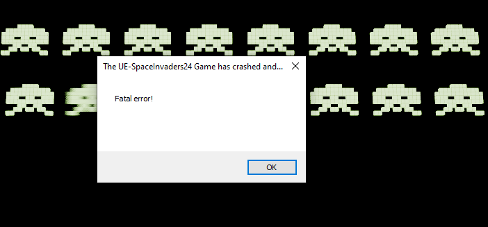
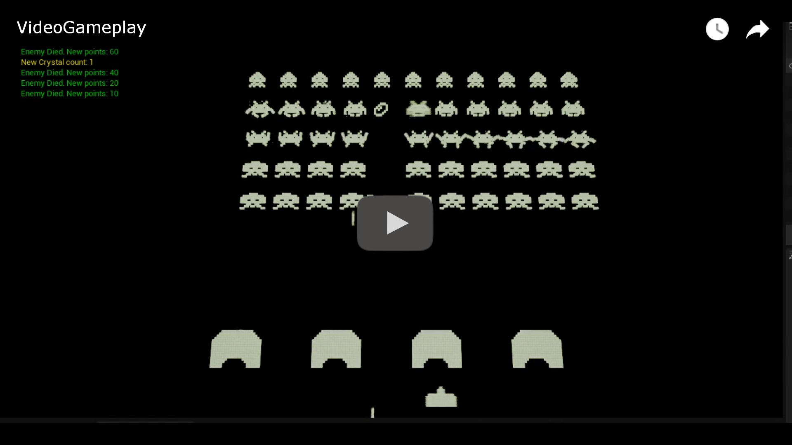

Well, it's time, and I managed to complete a large part of the challenge. I prioritized maintaining clean and scalable code over finishing with a project full of patches. Some of the tasks couldn't be completed, not due to lack of ability but due to lack of time. I estimate that with two more days, I could complete the remaining points, which include making the bunkers able to receive shots and erode, game flow and scenes, and of course, a UI to assist us.

My priorities were to make the enemies increase their speed as the quantity decreased and to make the player's abilities work, including the biggest challenge of making time able to rewind, and the truth is that the solution to that problem was simpler than I imagined.

Unfortunately, when it came time to finalize this challenge and build the game, I encountered what happens to anyone when they're in a hurry and want to print a document. A cryptic error that prevents the game from running, and [searching for a solution in the Unreal forums](https://www.google.com/search?q=No+precompiled+movie+scene+data+is+present+for+sequence+%27Sequence%27.+This+should+have+been+generated+and+saved+during+cook.+site:forums.unrealengine.com&sca_esv=40c8a0742f288946&sca_upv=1&sxsrf=ACQVn0_venAEdIhBeIwfR0I3jNxdvbC61w:1714013358571&sa=X&ved=2ahUKEwjnsoKrrdyFAxW0qpUCHUXlC2EQrQIoBHoECCMQBQ&biw=1920&bih=959&dpr=1#ip=1), I find many people who have encountered the same issue, all without an answer.

I changed the build configuration from Development to Shipping, and the result was another error.

The most curious thing about this is that I didn't change anything in the project configuration when just today I managed to build successfully. Luckily, I saved it, and now I can share it with you. The bad news is that this version, which works, is outdated and doesn't contain two of the requested and most important requirements: one is that in this version, we don't have the abilities to manipulate time available, and the other is that in this version, enemies don't shoot at the player, so the only way to lose is for the enemies to reach the player.

Because of this, I record a video of the updated gameplay from the Unreal editor so that at least you can see clearly what the final version of the game contains.

---

If you want to try the playable version of this project, [the following link](https://drive.google.com/file/d/1vzxFHMdYkiYCXqNVAkuTV51b_oH3GZkf/view?usp=drive_link) will provide you with an executable for Windows. The game controls are as follows: 
* Move sideways: ←→ (arrow keys) 
* Shoot: Spacebar 
* Slow time: 1 (requires at least 1 crystal) 
* Stop time: 2 (requires at least 2 crystals) 
* Reverse time: 3 (requires 3 crystals) 
* To exit the game press Alt + F4